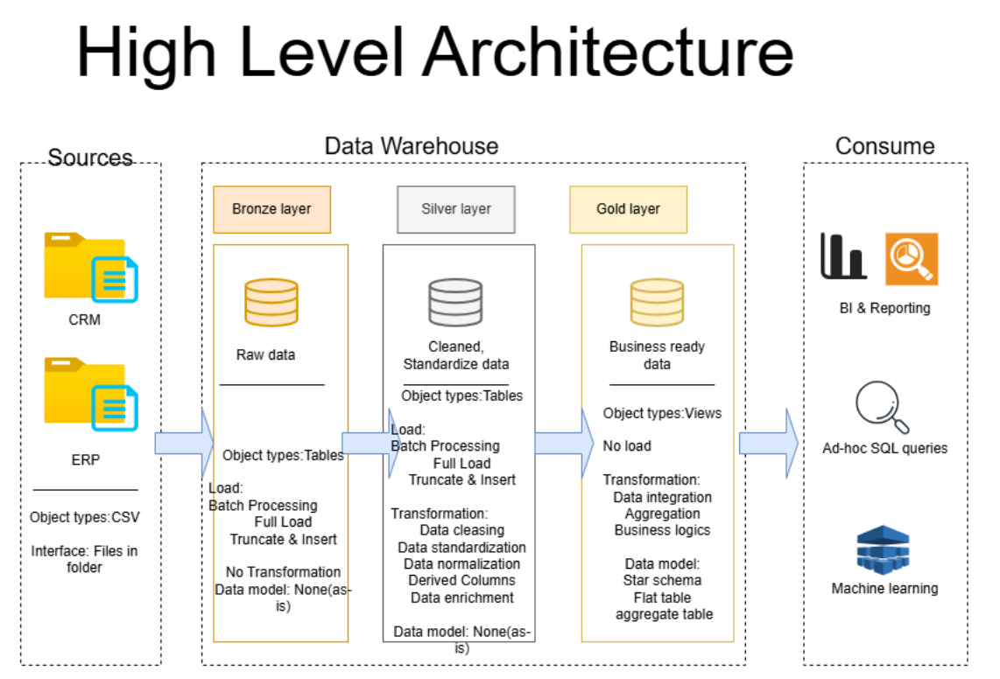

## Building the Data Warehouse (Data Engineering)

# Project Overview

This project involves:

1.  **Data Architecture:** Designing a Modern Data Warehouse Using Medallion Architecture Bronze, Silver, and Gold layers.
2.  **ETL Pipelines:** Extracting, transforming, and loading data from source systems into the warehouse.
3.  **Data Modeling:** Developing fact and dimension tables optimized for analytical queries.
4.  **Analytics & Reporting:** Creating SQL-based reports and dashboards for actionable insights.

**Objective**

Develop a modern data warehouse using SQL Server to consolidate sales data, enabling analytical reporting and informed decision-making.
# Data Architecture

The data architecture for this project follows Medallion Architecture Bronze, Silver, and Gold layers:



1.  **Bronze Layer:** Stores raw data as-is from the source systems. Data is ingested from CSV Files into SQL Server Database.
2.  **Silver Layer:** This layer includes data cleansing, standardization, and normalization processes to prepare data for analysis.
3.  **Gold Layer:** Houses business-ready data modeled into a star schema required for reporting and analytics.

---

# Important Links & Tools:

Everything is for Free!

* [Datasets](https://github.com/chohjingyia23cs0296/sql-data-warehouse-project/tree/main/scripts): Access to the project dataset (csv files).
* [SQL Server Express](https://www.microsoft.com/en-us/sql-server/sql-server-downloads): Lightweight server for hosting your SQL database.
* [SQL Server Management Studio (SSMS)](https://learn.microsoft.com/en-us/ssms/install/install?view=sql-server-ver16): GUI for managing and interacting with databases.
* [Git Repository](https://github.com/): Set up a GitHub account and repository to manage, version, and collaborate on your code efficiently.
* [DrawIO](https://www.drawio.com): Design data architecture, models, flows, and diagrams.
* [Notion](https://www.notion.com/templates/sql-data-warehouse-project): Get the Project Template from Notion.
* [Notion Project Steps](https://www.notion.so/Data-Warehouse-Project-30508d879ca0806fa6c2d0077e849cbc?source=copy_link): Access to All Project Phases and Tasks.

---

# Project Requirements

## Building the Data Warehouse (Data Engineering)

**Objective**

Develop a modern data warehouse using SQL Server to consolidate sales data, enabling analytical reporting and informed decision-making.

**Specifications**

* **Data Sources:** Import data from two source systems (ERP and CRM) provided as CSV files.
* **Data Quality:** Cleanse and resolve data quality issues prior to analysis.
* **Integration:** Combine both sources into a single, user-friendly data model designed for analytical queries.
* **Scope:** Focus on the latest dataset only; historization of data is not required.
* **Documentation:** Provide clear documentation of the data model to support both business stakeholders and analytics teams.

## BI: Analytics & Reporting (Data Analysis)

**Objective**

Develop SQL-based analytics to deliver detailed insights into:

* **Customer Behavior**
* **Product Performance**
* **Sales Trends**

These insights empower stakeholders with key business metrics, enabling strategic decision-making.

For more details, refer to [docs/requirements.md](https://placeholder.link/docs/requirements.md).

---

# Repository Structure
### 📁 Repository Structure

```text
data-warehouse-project/
│
├── datasets/                             # Raw datasets used for the project (ERP and CRM data)
│
├── docs/                                 # Project documentation and architecture details
│   ├── data_architecture.drawio          # Draw.io file shows the project's architecture
│   ├── data_catalog.md                   # Catalog of datasets, including field descriptions and metadat
│   ├── data_flow.drawio                  # Draw.io file for the data flow diagram
│   ├── data_models.drawio                # Draw.io file for data models (star schema)
│
├── scripts/                              # SQL scripts for ETL and transformations
│   ├── bronze/                           # Scripts for extracting and loading raw data
│   ├── silver/                           # Scripts for cleaning and transforming data
│   └── gold/                             # Scripts for creating analytical models
│
├── tests/                                # Test scripts and quality files
│
├── README.md                             # Project overview and instructions
├── LICENSE                               # License information for the repository
├── .gitignore                            # Files and directories to be ignored by Git
└── requirements.txt                      # Dependencies and requirements for the project
```


# 🛡️ License
This project is licensed under the MIT License. You are free to use, modify, and share this project with proper attribution.
